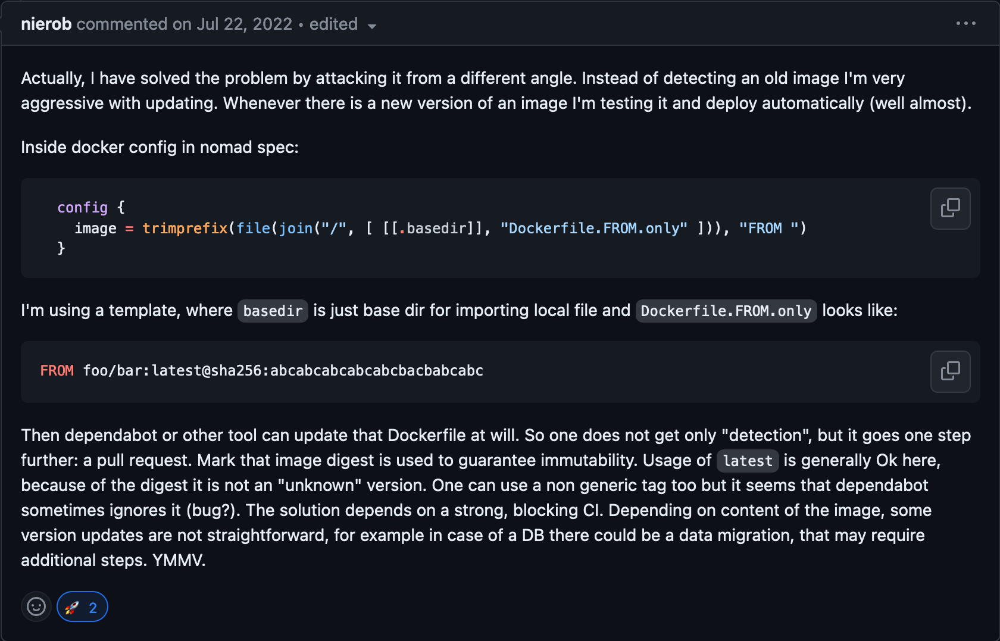

+++
title = "Automated Nomad Docker Image Updates"
+++

For a few years now I've grumbled at updating Docker images in my Nomad homelab. Nomad isn't as popular as Kubernetes or Docker Compose and isn't supported in Dependabot.

Eventually I found [this comment](https://github.com/hashicorp/nomad/issues/13061#issuecomment-1192472280)

I didn't think this was a great solution to my problem as I split up the registry from the repo/image so that I can pull images from my own repository. This solves the problem of Dependabot updating images though!

There was also an annoyance that I still need to copy these images into my Docker Registry. I've been using [regclient](https://github.com/regclient/regclient)'s `regctl image copy` command as part of a [Nomad job](https://github.com/philipcristiano/nixos-cluster-config/blob/c60e0ab1b1536db9857a137e7947df5a56336bb8/services/regctl/regctl.nomad) that makes this a bit easier.

### Tada

If the Dockerfile now has a `FROM [IMAGE]` in the service directory the deploy process now looks like:

* `awk` the image out `awk '/FROM/ {print $2}' Dockerfile`
* Dispatch the `regctl` job with the `IMAGE`
* Deploy the service job passing in the `IMAGE` as a variable.

[Dependabot](https://github.com/dependabot/dependabot-core/issues/2178) doesn't seem to do great with monorepos without lots of copying.

[Renovate](https://github.com/apps/renovate) does though!

[Finally, a service that can autoupdate!](https://github.com/philipcristiano/nixos-cluster-config/blob/424743df6fca82ff0b34908eb0550e66ea10392d/services/hello_idc/deploy.sh)

Merges on Github do not automatically deploy to my homelab so the final deploy takes 2 more commands to deploy (`git pull` and `bash deploy`) but this no longer requires any manual commits!
